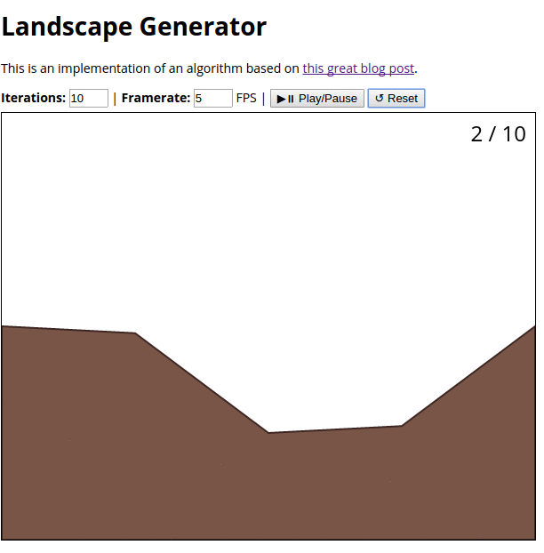

# Landscape Generator

This is an implementation of an algorithm based on [this great blog post][inspiration].

The algorithm generates a simple 2D landscape and can be extended to generate
all kinds of different sceneries.

[inspiration]: https://bitesofcode.wordpress.com/2016/12/23/landscape-generation-using-midpoint-displacement/

## Demo

